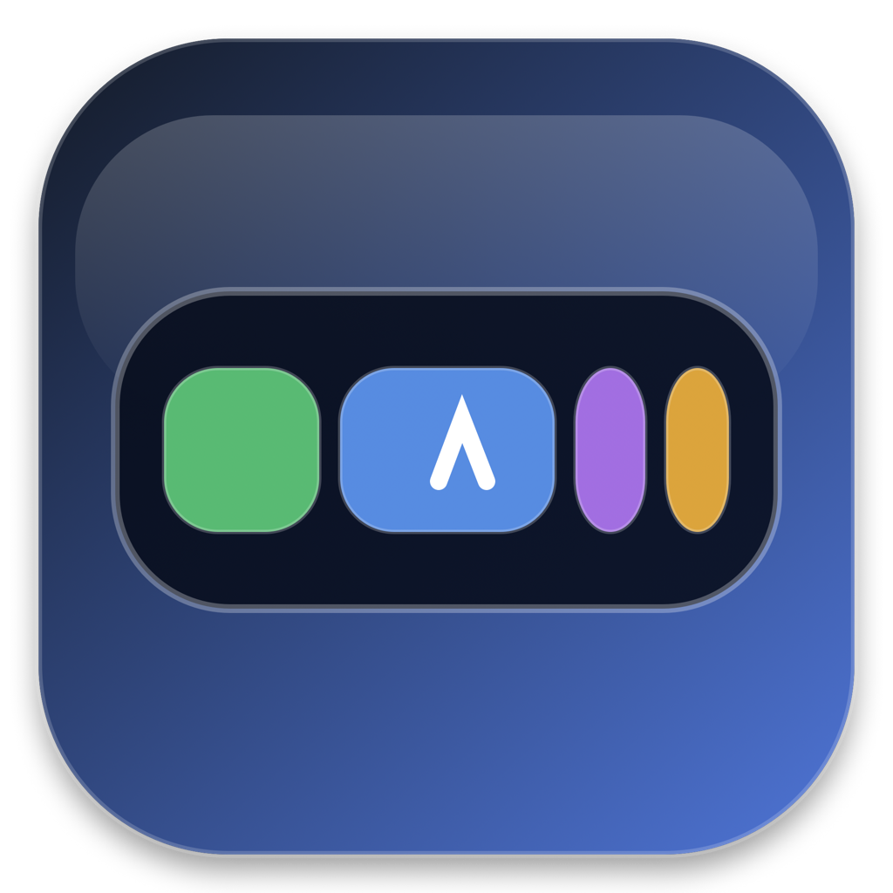
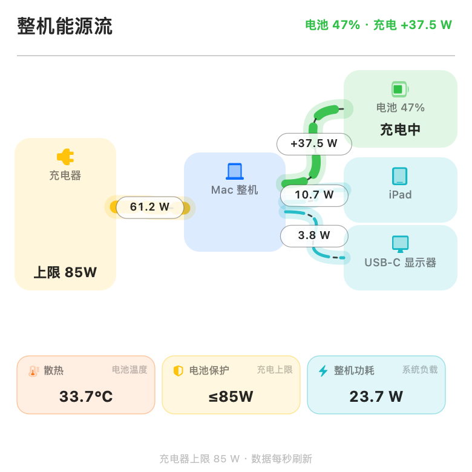
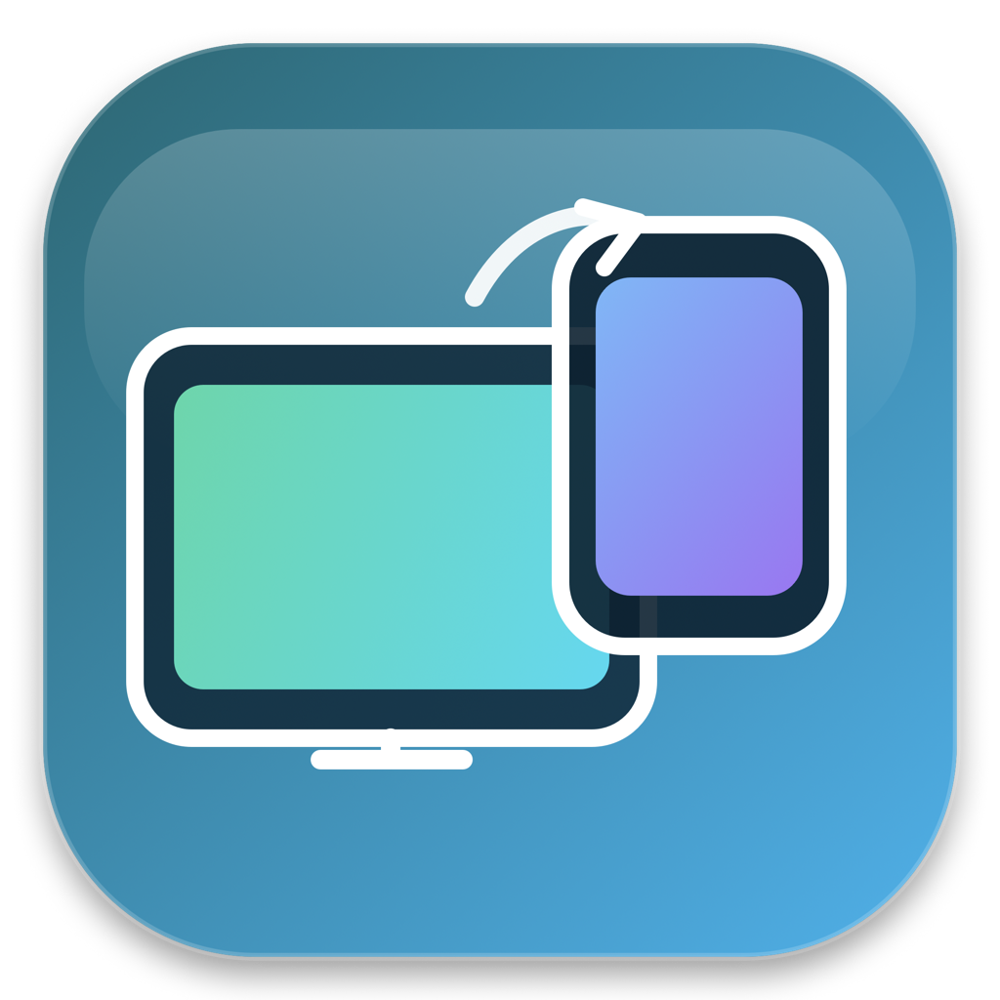
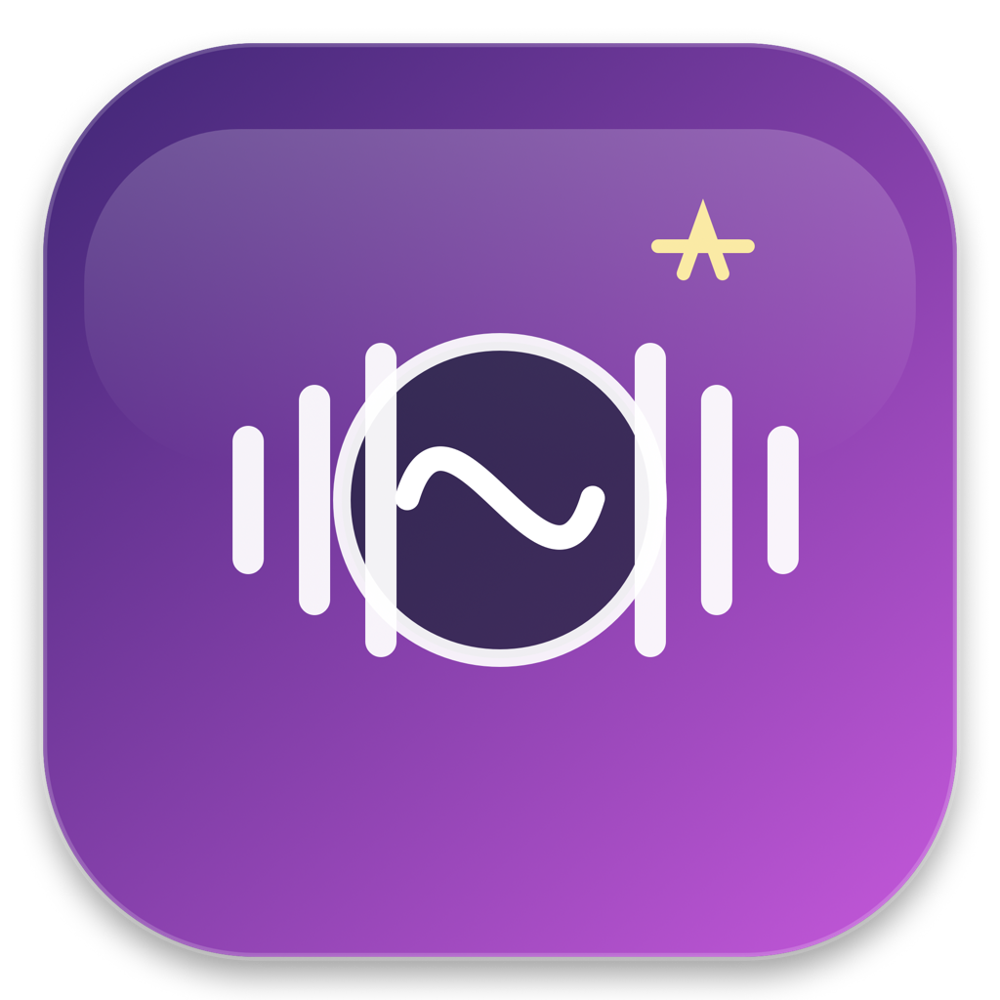

<p align="center">
  
</p>

<h1 align="center">Bar Control</h1>

<p align="center">让 MacBook Pro 的 Touch Bar 重新成为 AI、随航与整机状态控制台。</p>

<p align="center">
  
  
  
</p>


Bar Control 是一套原生 macOS Touch Bar 工具。主 App 不依赖 BetterTouchTool；随航与本地语音作为可选伴侣 App，没安装时不会占用额外资源。

## 一条 Touch Bar，四个入口

- **随航 ⇄ 通用控制**：连接、断开和失败阶段有颜色及展开动画。
- **AI coding**：显示 Codex 额度、正在运行的任务和最新回复。
- **整机监控**：RunCat 风格动图随实时功率改变速度，点按查看功率、内存、GPU、温度和 USB-C 输入输出。
- **本地语音**：录音、识别、本地/云端判断和播放阶段使用紧凑动画，不遮挡后面的模块。

<p align="center">
  
</p>

## 实时能源流

菜单栏面板按真实方向展示充电器、Mac、电池和外接设备之间的功率；流线粗细随功率缩放，功率越大线条越宽，具体设备用图标表示，功率数值直接标在流线中间。底部用三张状态卡展示散热、电池保护阈值与整机功耗，图上已有数值不会在下方重复。没有外接输出时不会保留空节点；数值每秒更新，虚线速度与方向跟随当前功率。

<p align="center">
  
</p>

## 三个原生 App

| App | 图标 | 用途 | 必需性 |
| --- | :---: | --- | --- |
| **Bar Control** |  | Touch Bar 主界面、AI coding、能源流和系统监控 | 必需 |
| **随航管家** |  | 一键连接或断开 iPad 随航 | 可选 |
| **本地模型** |  | Whisper + Ollama 本地语音入口 | 可选 |

三款图标采用同一套圆角、玻璃高光和深色渐变语言，同时保留各自的 Touch Bar、双屏和声波特征。

## 安装

需要带实体 Touch Bar 的 MacBook Pro、macOS 13 或更高版本，以及完整 Xcode。构建脚本会用系统原生 `actool` 生成 macOS 27“App”启动器可识别的图标资源；如果 `xcode-select` 当前指向 Command Line Tools，会自动查找本机已安装的 Xcode。

```sh
git clone https://github.com/cth123456/bar-control.git
cd bar-control
./Apps/BarControl/install.command
```

安装后，Bar Control 会注册为 macOS 登录项。菜单栏和 Touch Bar 的 Control Strip 都能重新唤出主界面。

### 随航管家

随航助手需要 [BetterDisplay](https://github.com/waydabber/BetterDisplay)。安装前先配置系统菜单里显示的 iPad 名称：

```sh
defaults write local.codex.SidecarPilot TargetDevice "我的 iPad"
./Apps/SidecarPilot/install.command
```

### 本地语音

本地语音需要 Ollama、`whisper-cpp`、Whisper small 模型和已下载的高质量普通话 `Linfei` 声音。完整安装步骤见 [本地模型说明](Apps/LocalModelVoice/README.md)。

<p align="center">
  
</p>

## 自定义

从菜单栏选择“更多操作 → 自定义 Touch Bar 组件…”，可以调整四个模块的显示、宽度和顺序；“Touch Bar 动图”可切换猫、狗、咖啡、水滴、引擎、麻薯、牛顿摆和史莱姆。

## 构建

```sh
./build-all.command
```

默认生成仅供本机运行的临时签名 App。需要开发者签名时：

```sh
SIGN_IDENTITY="Apple Development: ..." ./build-all.command
```

安装脚本会在覆盖 App 后主动刷新 LaunchServices 登记，避免启动台继续使用旧版本图标。

## 隐私与兼容性

- Bar Control 只读本机 Codex 与 CC Switch 状态，不读取或上传供应商密钥。
- 本地语音的录音与 Whisper 转写始终留在本机；只有明确升级云端时才发送转写文字。
- Touch Bar 全局入口和亮度控制使用 macOS 私有接口，未来系统版本可能需要适配。
- USB-C 端口功率取决于设备是否向 IOKit 发布遥测，无法上报的设备不会伪造数值。

## 开源许可

项目源码使用 [MIT License](LICENSE)。RunCat Neo 动画帧保持原有 Apache License 2.0；详情见 [第三方声明](THIRD_PARTY_NOTICES.md)。
